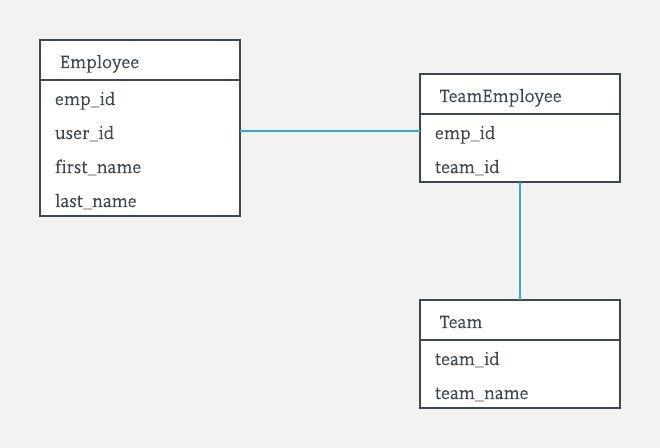

# Basic HR Management System

## Problem Statement

We are building a basic HR management system. We need the following pieces of functionality in the system:
1. A user should be able to create an employee
2. A user should be able to list all employees in the company
3. A user should be able to create a team
4. A user should be able to assign employees to teams

## Clarifying Requirement Questions

1. How many employees should the system be able to handle.?  
Assumptions : [The worlds largest employers](https://en.wikipedia.org/wiki/List_of_largest_employers) aka defence
organizations like US DOD and People's liberation army have around 3 Million employees.
However even the biggest private sector employer like Amazon has no more than 500K employees. Most small and medium size businesses have less than a few hundred employees.
For the purpose of this exercise the employee size is estimated to be no more than 500K.

2. Can a person belong to multiple teams ?  
Assumption : Yes. The user may belong to one or more team.

3. Who can create an employee and assign employee's to teams?  
Assumption: Typically HR system like Workday and PeopleSoft would have a sofisticated roles/privileges based system which defines
who can perform administrative functions. For the purpose of this exercise we will assume any employee can perform these operations.

4. How will users interface with the system ?  
Assumption : Typically employees would be using a web portal or mobile app to interface with the system.
The scope of this exercise we be limited to exposing RESTful API's which will be consumed by the web portal and/or mobile app.

5. How will users be authenticated ?  
Assumption: Typically HR system support Single Sign On (using openid , SAML, OAuth) and are authenticated/authorized against
a SSO system or a corporate LDAP database.
For the purpose of this exercise we will not enforce any authentication/authorization.

6. Compliancies / Legal Requirements ?  
Assumptions : HR systems typically fall under compliance regulations (SOC, PII, PCI, ) and other local laws and regulations.
Sensitive data is encrypted over the wire and at rest. No encryption wil be enforced as part of this coding exercise.

7. SLA requirements ?  
Assumption : 99% uptime which gives yearly down time of 8h 45m 57.0s


## Technical Design Considerations

### Data Storage
The desirable features for data storage systems for such a system is one which
provides consistency, durability, atomicity and isolation. Hence we will design a system which uses an RDBMS like
Oracle , MySQL or Postgres. HRMS systems for employeer's with 3 million employees, a NoSQL database like Dynamodb or Cassandra could be considered.
Since the application seems read heavy (list employees, list teams) we will have multiple read slave instances and a single master for writes.
The slave can be promoted to master in case the master fails (This may work for an SLA of 99% but not higher).
In cases where the application is write intensive as well, we may have to come up with other scaling/sharding strategies.
For performance data can also be cached in a distributed cache like Redis or Memchache

The DBMS ERD for the basic functionality above is as shown below.



### API layer

#### Create Employee
```
POST   /v1/hr/employee
Request Payload :
{
"userId" : "sbagdadi",
"firstName" : "Shah",
"lastName" : "Bagdadi"
}

Success Response - Http 201 (Created)
{
 "empId" : "E0000001"
 }

 Error Response - Http 422 (Unprocessable)
 {
 "errors" :
    [
    {
      "code" : 4001,
      "id" : "userId",
      "description" : "userId already exists",
      },
     { "code" : 4002,
       "id" : "firstName",
       "description" : "firstName cannot be blank",
     }
     ]
 }
```


#### Create Team
```
POST   /v1/hr/team
Request Payload :
{
 "name" : "Tiger Team"
}

Success Response - Http 201 (Created)
{
 "teamId" : "T0000001"
 }

```

#### LIST all Employees
This end point will only return 10 records by default.
The endpoint can be passed optional query paramters
page - The page to return
per_pages - The number of records per page.
```
GET   /v1/hr/employee?page=N&per_page=M

Success Response - Http 200 (OK)
{
 "employees" :
    [
    {
      "empId" : "E0000001",
      "firstName" : "Shah",
      "lastName" : "Bagdadi",
      },
    {
      "empId" : "Mayank",
      "firstName" : "Kumar",
      "lastName" : "Bagdadi",
      }
     ],
  "totalRecords" : 2
 }

```


#### Assign Team
This endpoint will support both http PUT and PATCH verb.
PUT - Will replace the current list of employees in the team with the employees in the input request
PATCH - Will all the employee in the input request to the current list of employees in the team.

```
PATCH   /v1/hr/team/<team_id>
PUT   /v1/hr/team/<team_id>
Request Payload :
{
"employees" : ["E000001" , "E000002"]
}

Success Response - Http 204 (OK)


Error Response - Http 422 (Unprocessable)
 {
 "errors" :
    [
    {
      "code" : 4003,
      "id" : "E000001",
      "description" : "Employee does not exists",
      }
     ]
 }
```

### Developer Notes
1. To run the program install mysql
2. git clone the repo
3. Change the mysql username and password in the application.properties
4. cd hr
5. mvn spring-boot:run 
6. Use a rest client like postman to make API calls as per the design above.
